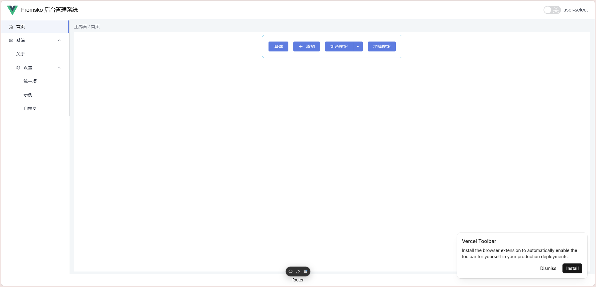

# element-plus-vite-starter



## Project setup

```bash
npm install
```

### Compiles and hot-reloads for development

```bash
npm run dev
```

### Compiles and minifies for production

```bash
npm run build
```

## Usage

```bash
git clone https://github.com/fromsko/element-plus-vite-template
cd element-plus-vite-starter
npm i
npm run dev
```

## 更换框架 Devui

```shell
bun i vue-devui @devui-design/icons devui-theme
```

`引入样式`

```ts
import DevUI from 'vue-devui';
import 'vue-devui/style.css';
import '@devui-design/icons/icomoon/devui-icon.css';
import { ThemeServiceInit, infinityTheme } from 'devui-theme';

ThemeServiceInit({ infinityTheme }, 'infinityTheme');

createApp(App).use(DevUI).mount('#app');
```

`使用`

```html
<template>
  <!-- 使用 Button 组件 -->
  <d-button>确定</d-button>
</template>
```

`按需引入`

```shell
bun i -D unplugin-vue-components
```

---

```html
<script setup lang="ts">
import { ref } from "vue";
import { ElMessage } from "element-plus";

defineProps<{ msg: string }>();

const count = ref(0);
const input = ref("element-plus");

const curDate = ref("");

const toast = () => {
  ElMessage.success("Hello");
};

const value1 = ref(true);
</script>
```
